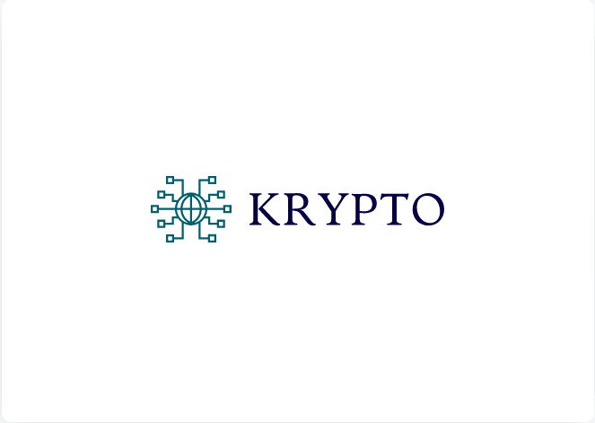

# Krypto
A simple web application using the ReactJS framework to demonstrate the working of a Blockchain in <b>Cryptocurrency</b>.



## Getting started
1. Clone the repository
```bash
git clone https://github.com/sherwyn11/Krypto.git
```
2. Download the required npm packages
```bash
cd Krypto
npm install
```
3. Start the React development server
```bash
npm start
```

## Demo


## What's happening behind the scenes?
<ul>
  <li> The app generates a key pair(Public Key, Private key) using the elliptic npm package.</li>
  <li> The user can then create a transaction to the address(Public Key) of the receiver with the amount of Kryptos to be transferred.</li>
  <li>Each transaction is then hashed using SHA-256 hashing algorithm and then signed using the Private key of the sender</li>
  <li>Once the transaction is made it is added to the Pending Transactions.</li>
  <li>Ideally, after this stage the miners will try to mine the pending transactions by solving a complex mathematical problem. This is a consensus algorithm called as <b>Proof of Work</b>.</li>
  <li>Whichever miner solves the problem first will then add the block to the chain and obtain a reward of 100 Kryptos.</li>
  <li>The block is then added to the chain and every node gets a copy of the blockchain.</li>
  <li>Once the block is added every node checks the validity of the blockchain.</li>
  <li>A user can view his current balance of Kryptos in the 'MyWallet' section.</li>
  <li>A user can also view all transactions in a block by clicking on 'View Transactions' on the block of his/her choice.</li>
</ul>

## What is the Blockchain Technology?
Blockchain, sometimes referred to as Distributed Ledger Technology (DLT), makes the history of any digital asset unalterable and transparent through the use of decentralization and cryptographic hashing.  

A simple analogy for understanding blockchain technology is a Google Doc. When we create a document and share it with a group of people, the document is distributed instead of copied or transferred. This creates a decentralized distribution chain that gives everyone access to the document at the same time. No one is locked out awaiting changes from another party, while all modifications to the doc are being recorded in real-time, making changes completely transparent.

Of course, blockchain is more complicated than a Google Doc, but the analogy is apt because it illustrates three critical ideas of the technology: 

## How Does Blockchain Work?
The whole point of using a blockchain is to let people — in particular, people who don't trust one another — share valuable data in a secure, tamperproof way.
— MIT Technology Review

Blockchain consists of three important concepts: blocks, nodes and miners.

### Blocks
Every chain consists of multiple blocks and each block has three basic elements:

The data in the block.
A 32-bit whole number called a nonce. The nonce is randomly generated when a block is created, which then generates a block header hash. 
The hash is a 256-bit number wedded to the nonce. It must start with a huge number of zeroes (i.e., be extremely small).
When the first block of a chain is created, a nonce generates the cryptographic hash. The data in the block is considered signed and forever tied to the nonce and hash unless it is mined.  

### Miners
Miners create new blocks on the chain through a process called mining.

In a blockchain every block has its own unique nonce and hash, but also references the hash of the previous block in the chain, so mining a block isn't easy, especially on large chains.

Miners use special software to solve the incredibly complex math problem of finding a nonce that generates an accepted hash. Because the nonce is only 32 bits and the hash is 256, there are roughly four billion possible nonce-hash combinations that must be mined before the right one is found. When that happens miners are said to have found the "golden nonce" and their block is added to the chain. 

Making a change to any block earlier in the chain requires re-mining not just the block with the change, but all of the blocks that come after. This is why it's extremely difficult to manipulate blockchain technology. Think of it is as "safety in math" since finding golden nonces requires an enormous amount of time and computing power.

When a block is successfully mined, the change is accepted by all of the nodes on the network and the miner is rewarded financially.

### Nodes
One of the most important concepts in blockchain technology is decentralization. No one computer or organization can own the chain. Instead, it is a distributed ledger via the nodes connected to the chain. Nodes can be any kind of electronic device that maintains copies of the blockchain and keeps the network functioning. 

Every node has its own copy of the blockchain and the network must algorithmically approve any newly mined block for the chain to be updated, trusted and verified. Since blockchains are transparent, every action in the ledger can be easily checked and viewed. Each participant is given a unique alphanumeric identification number that shows their transactions.

Combining public information with a system of checks-and-balances helps the blockchain maintain integrity and creates trust among users. Essentially, blockchains can be thought of as the scaleability of trust via technology. 

## What is Proof-of-Work?
Proof-of-Work, or PoW, is the original consensus algorithm in a Blockchain network.

In Blockchain, this algorithm is used to confirm transactions and produce new blocks to the chain. With PoW, miners compete against each other to complete transactions on the network and get rewarded.

## Dependencies
<ul>
  <li>npm</li>
  <li>elliptic</li>
  <li>crypto-js</li>
</ul>

## References
<a href="https://developer.ibm.com/technologies/blockchain/tutorials/develop-a-blockchain-application-from-scratch-in-python/">Develop a blockchain application from scratch in Python</a>

## License

[](https://opensource.org/licenses/MIT)

[MIT License Link](https://github.com/sherwyn11/Krypto/blob/master/LICENSE)

<br></br>
© 2020 Sherwyn D'souza
